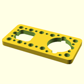
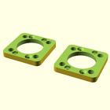

# OOBB Production File Summary for OOBB Holder For a TT Motor (6x3) with a Servo Driver
OOBB Holder For a TT Motor  (5x3) with a Servo Driver
## files

*  3dpr_1.stl  - Main - Main holder piece  
*  3dpr_2.stl  - Shaft Adapter - Shaft adapter  
*  3dpr_3.stl  - Wire Holder - Wire holder  
*  3dpr_4.stl  - Bearing - Holder for the 6705 bearing  
*  3dpr_5.stl  - Bearing - Holder for the 6705 bearing  
