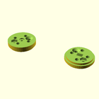

# OOBB Production File Summary for OOBB Holder For a Standard Servo (5x3)
OOBB Holder For a Standard Servo (5x3)
## files

*  3dpr_1.stl  - Main - Main body piece  
*  3dpr_2.stl  - Top - Top spacer piece  
*  3dpr_3.stl  - Adapter - Adapter from OOBB to a servo horn  
*  3dpr_4.stl  - Bearing - Holder for the 6705 bearing  
